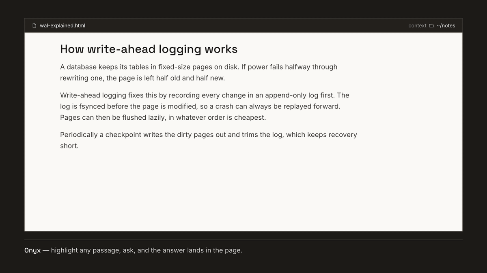

# Onyx

Onyx (formerly Ask Widget) is a local-first reading workspace for Claude Code and Codex. Open an HTML,
Markdown, text, or PDF document; select a passage; then right-click for **ELI5**,
**Prove it**, or **Ask a question**. Answers stream into the document and can use
read-only evidence from a context folder you choose.



<sub>Illustrative article and answer.</sub>

## Why

Asking an AI about something you are reading usually means copying the passage
into a chat and losing your place. Onyx brings the question to the passage:
answers stream into the page, grounded in a folder of source material you
choose, with citations that are checked to exist before they are shown. It runs
on your Mac against your own files, on the Claude or ChatGPT subscription you
already have, never an API key.

```text
selection → Onyx → local FastAPI service → Claude CLI (claude.ai subscription)
                ↑              │               ↘ Codex CLI (ChatGPT subscription)
                └──── answer, tool trace, validated citations ───────────────┘
```

## Quickstart

Requirements for building: macOS 13 or newer, Xcode command-line tools, and
Python 3.11 or newer. The built app needs at least one supported CLI installed:
Claude Code signed into claude.ai, or Codex signed in with ChatGPT.

```bash
git clone https://github.com/cxrobx/onyx.git
cd onyx
./launcher/build-app.sh
open -a "Onyx"
```

More build output, a checkout-only run, and a headless daemon are in [docs/install.md](docs/install.md).

Then open a document from **Library**, select a passage, right-click, and choose
**ELI5**, **Prove it**, or **Ask a question…**.

## What it does

Three actions on any selection, or on a whole page when nothing is selected:

- **ELI5** explains the passage plainly.
- **Prove it** verifies the passage against your context folder and returns a
  Supported, Partially supported, Not supported, or No evidence verdict.
- **Ask a question…** answers anything about it, with follow-ups.

Around them:

- Readers for HTML, Markdown, plain text, and text-based PDF, plus HTTPS pages.
- **Notes** and **Artifacts** sidebars: your Obsidian vault (wikilinks,
  frontmatter, outline, related pages) and a folder of links to HTML pages
  anywhere on your Mac.
- Streaming answers with a visible trace of every file read and web lookup, and
  evidence cards that open the cited source lines.
- Search (⌘P), find in page (⌘F), and a searchable history of past questions you
  can ask again, edit, or continue.
- Claude or Codex, with live model pickers, on your subscription only.
- An Obsidian plugin, an Alfred workflow, and a macOS Service, so the same
  actions work outside the app.

## Docs

| Doc | What's in it |
|---|---|
| [docs/features.md](docs/features.md) | The full feature list and recent version notes |
| [docs/install.md](docs/install.md) | Building the app from source, what the launcher does, running from a checkout, running headless, CLI options |
| [docs/reader.md](docs/reader.md) | Using the reader, Vault mode, Artifacts, supported documents, opening a document by URL |
| [docs/integrations.md](docs/integrations.md) | Finder, the macOS Services, the Alfred workflow and its `onx`/`onxc` search, the Obsidian plugin |
| [docs/storage.md](docs/storage.md) | Library, the database and what it saves, context roots, trusted roots |
| [docs/security.md](docs/security.md) | The security model of the local service |
| [docs/development.md](docs/development.md) | Test and build commands, release signing and notarization, project layout |
| [AGENTS.md](AGENTS.md) | Invariants and deliberate old names, for anyone changing the code |

## Contributing with an agent

Point your coding agent at [`AGENTS.md`](AGENTS.md) before it changes anything.
It is short on purpose: the invariants that must not be relaxed, the one command
that actually runs the suite, and the names that look stale but are load-bearing
contracts. Claude Code, Cursor, and Codex all read it automatically.

## License

MIT — see [`LICENSE`](LICENSE). Copyright © 2026 Christopher Robinson.

The project was renamed from **Ask Widget** to **Onyx**; the licence and its
copyright holder are unchanged by that, and the built wheel carries
`License-Expression: MIT` with `LICENSE` bundled. No third-party code is
vendored here, and every runtime dependency (FastAPI, uvicorn, markdown-it-py,
pypdf) is MIT- or BSD-licensed.
